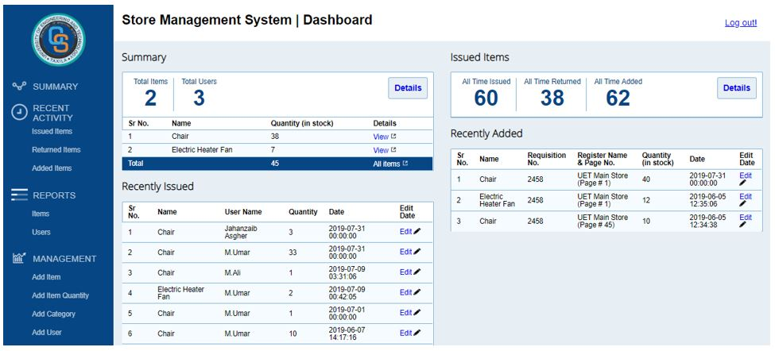

# **Store Management System**

---

**Note:** This system was designed for internal use of the institute without taking care of many security issues. Do use it with caution!

The basic aim to build this project is to reduce paper work and reduce significant amount of errors during paper work. The issued products by the admin/in-charge will be added to respected user account which later on, upon returning will be dissociated from the user.

Used Languages:
*   PHP
*   HTML & JavaScript
*   MySQL

Just import the database `database.sql` and you're good!
 
Check the `report.pdf` to get an idea of all features developed for the system.

## Things you can improve
You can upgrade the folder structure and sql queries to prepared statements. If you do changes (upgrade) just send a request and I'll be happy to approve your changes.
 
Also feel free to fork!

**Do good things!**